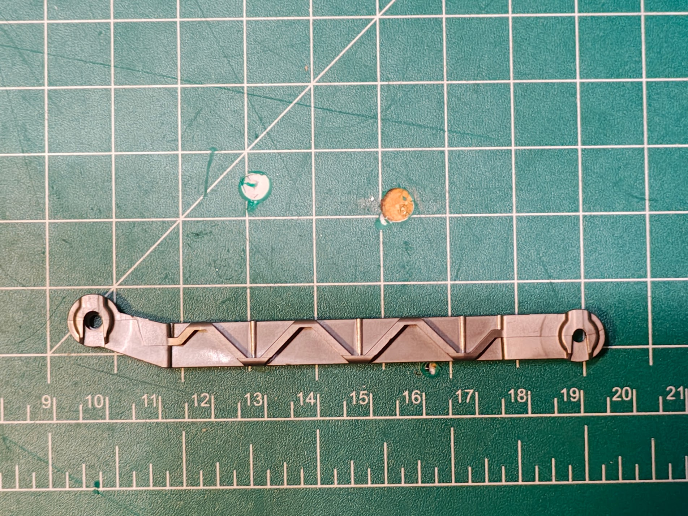
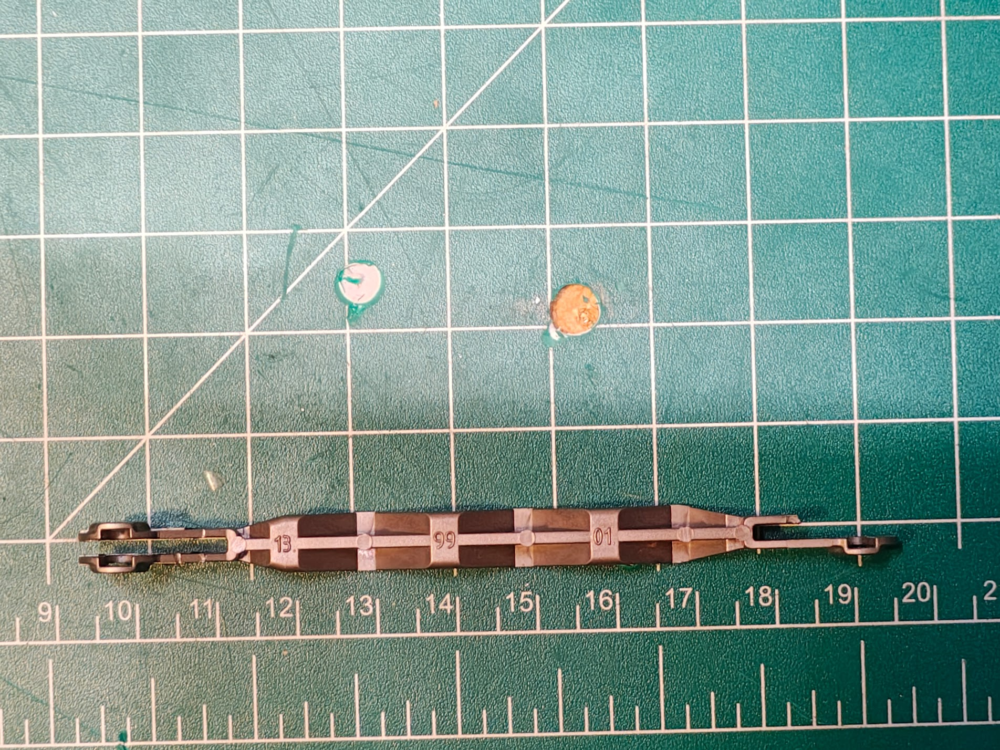
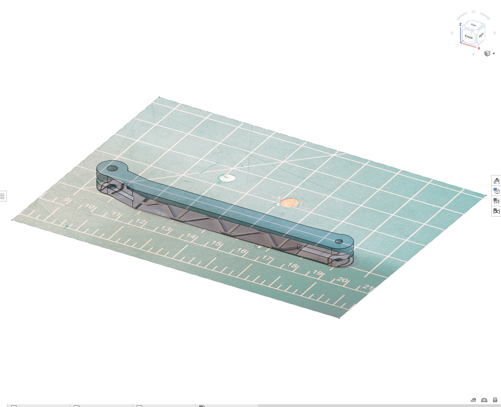
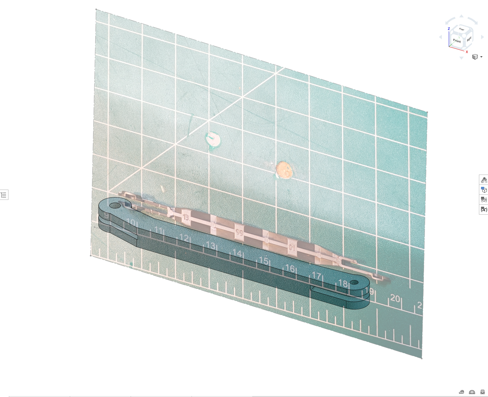

# Bruder Recycling Truck Repair

My kid's Bruder recycling truck is one of his favorite toys. The arm that lifts the garbage cans and dumps the contents into the truck broke, and the truck lost its main feature. So I decided to reverse engineer the part and print a replacement.

## Modeling the Part

I put the broken linkage on the cutting mat and used the [[tracing-rig|photo tracing rig]] to get accurate top-down photos from both angles. Imported the photos into Onshape, scaled them using the cutting mat grid, and modeled the replacement part on top of the originals.

*Broken grabber linkage, front view*

*Top view*

*CAD model overlaid on the photo for fit checking*

*Top view overlay*

## Result

The replacement part isn't a perfect fit. It's a bit bulky. But the first print restored functionality to the truck, and that's what matters. My kid fills the little recycling bins with scraps of paper and loves dumping them in the truck with the grabber. Works for me.

I hope my kids take notice of me fixing their toys instead of throwing them away. It gives me great joy to see them happy when something they love is fixed. It's never as good as new, but it's still pretty good.
