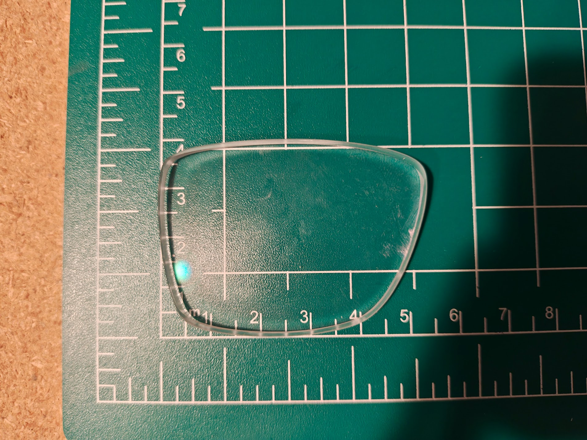
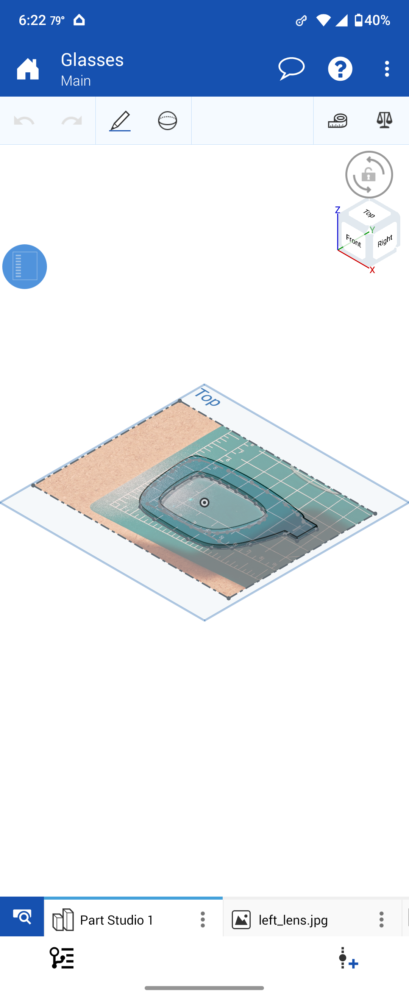
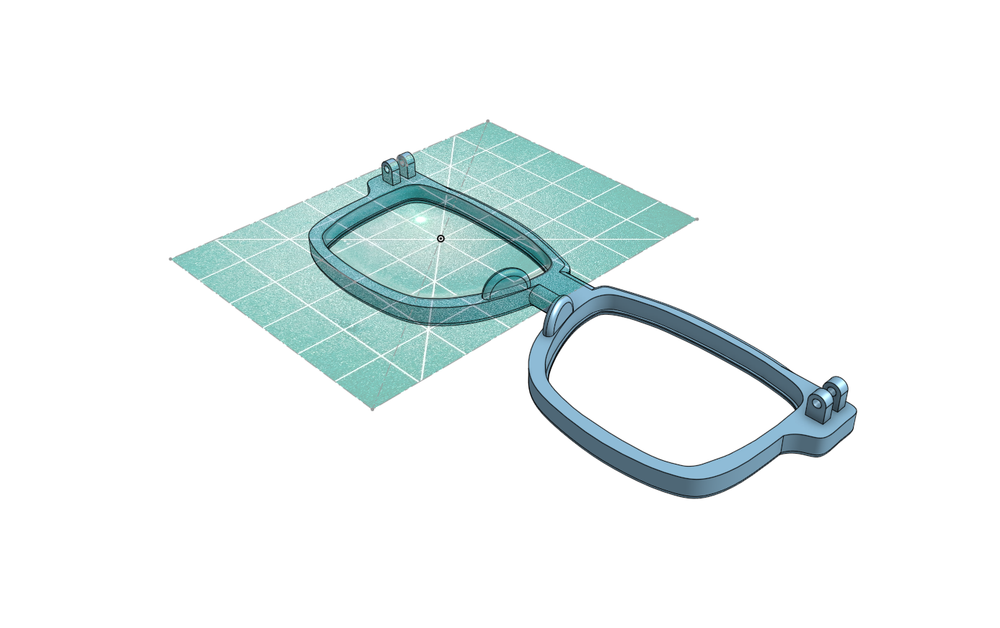
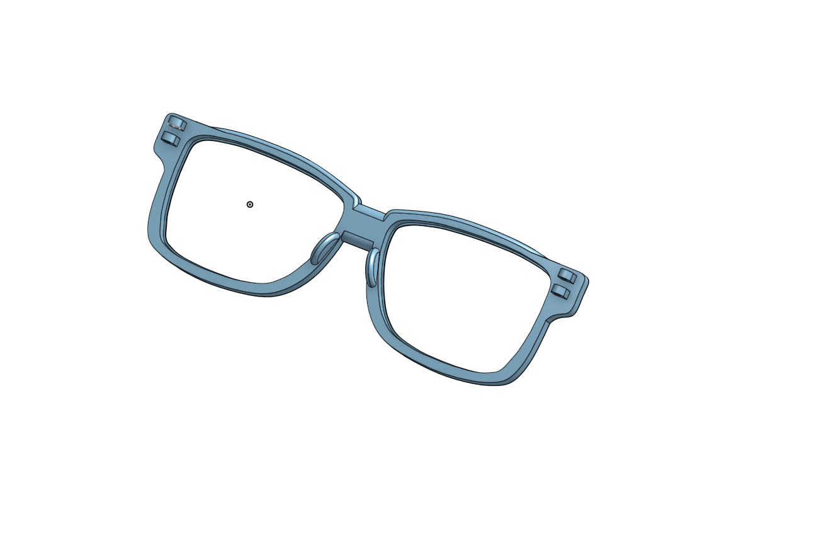
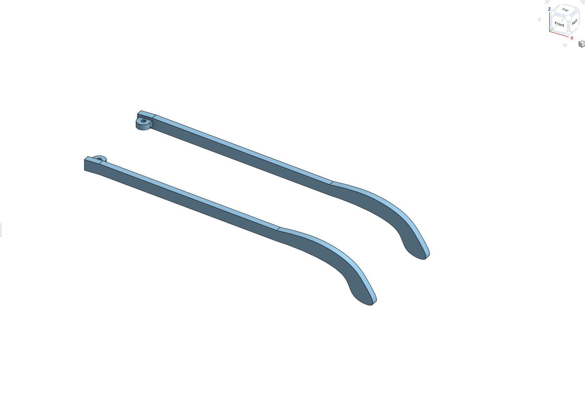
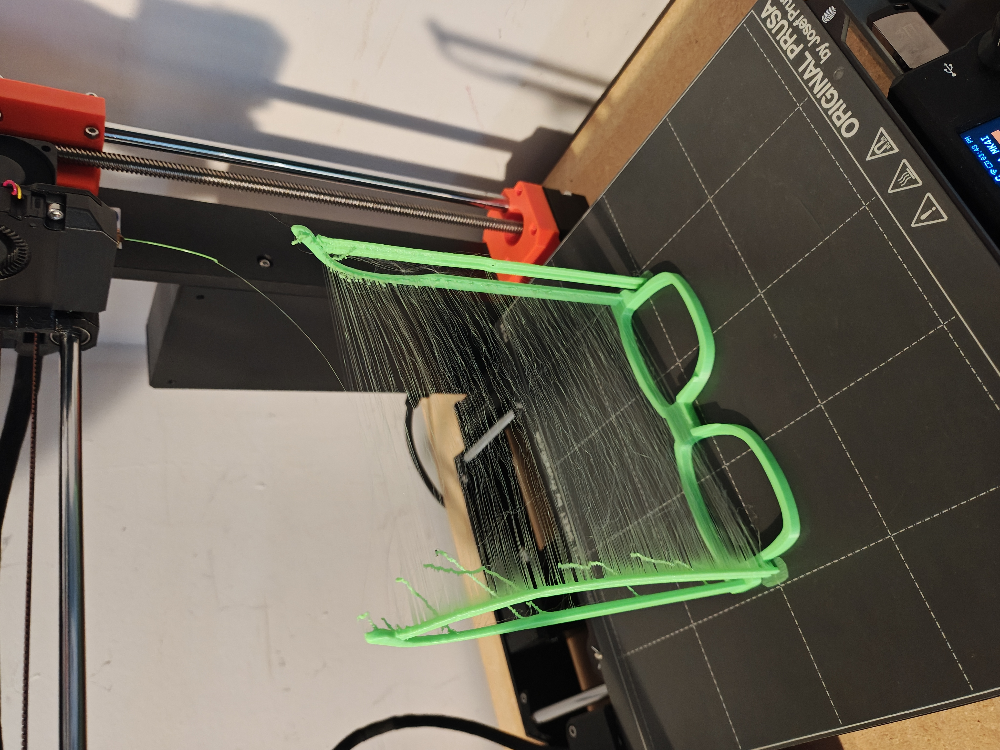
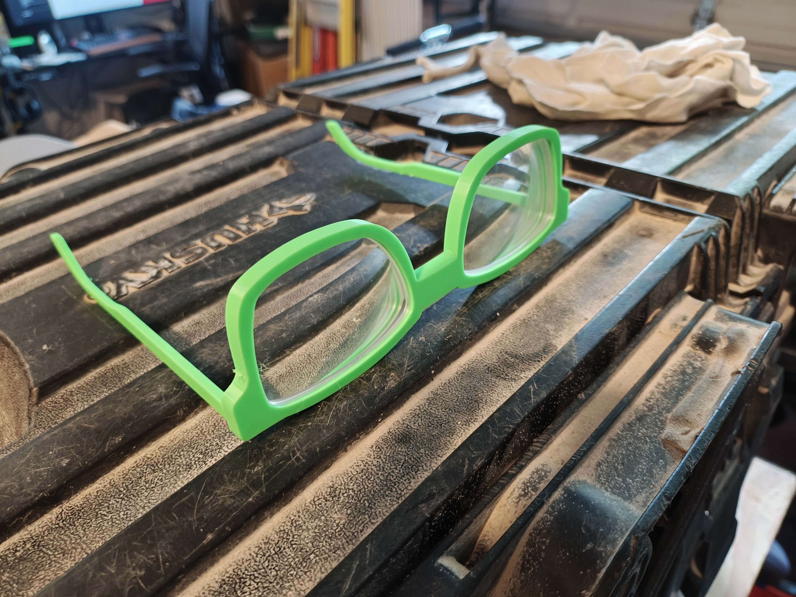

# 3D Printed Glasses Frames

My brother's glasses frames broke but he still had the lenses. I thought it would be a fun project to design and print new frames for him. Good excuse to learn more CAD, and how hard could it be?

Pretty hard, it turns out.

## Getting the Lens Right

The first major challenge was getting accurate lens measurements. I placed the lens on a cutting mat and started trying to model around it, but the first few prototypes weren't even close to fitting. I was just iterating over and over, wasting plastic, and guessing at dimensions.

*Prescription lens on the cutting mat*

There had to be a better way. So I built a [[tracing-rig|camera rig]] out of small aluminum extrusion to hold my phone and take accurate top-down photos. I imported the photo into Onshape and used the cutting mat grid to set the scale. From there I could trace the lens outline directly in the CAD model. Better images helped immensely. After that I got a prototype frame that actually fit the lens.

*Tracing the lens outline in Onshape using the photo as a reference*

*CAD model overlaid on the lens photo to check fit*

## Design

The frames got better as I got better at CAD. The first full frame prototype had stationary temple arms, printed as one piece. As I improved, I was able to design the frames and arms as separate parts and assemble them after printing.

*Front frame design with hinge points for the temple arms*

*Temple arms designed as separate parts*

*Full assembly*

## Printing

Not every print went well.

*This one did not go well*

*Green prototype with the lens actually fitting*

*Complete green prototype with temple arms*

*Final frames in black*
