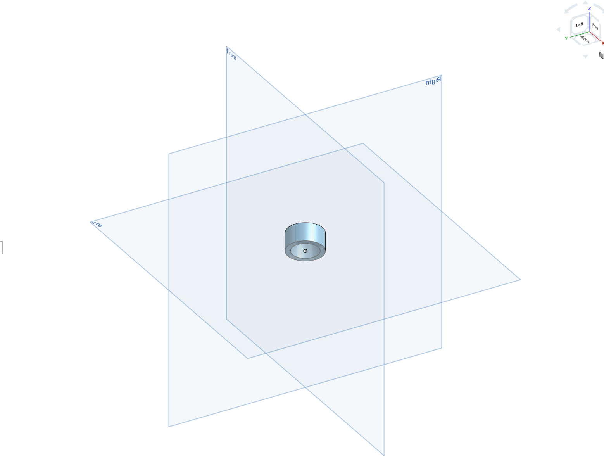
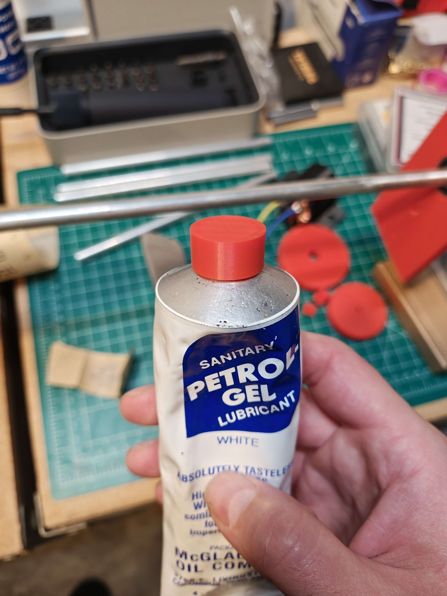

# Petrol-Gel Cap Replacement

I use petrol-gel for various homebrewing tasks, mostly lubing up o-rings. I've had this tube for many years and the cap broke for who knows what reason. Not everything needs to be a complex repair.

I measured the outer diameter of the original cap and the outer diameter of the tube threads. Then I designed a simple cylinder just slightly smaller than the tube threads, hoping the tube would self-thread when I screwed the cap on. Amazingly, it worked great.

*It's just a cylinder*

*Replacement cap on the tube*
