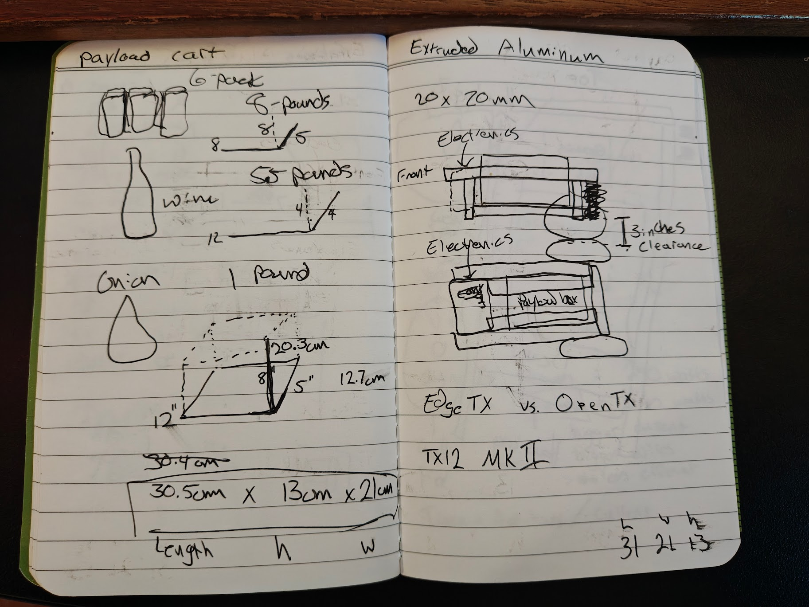
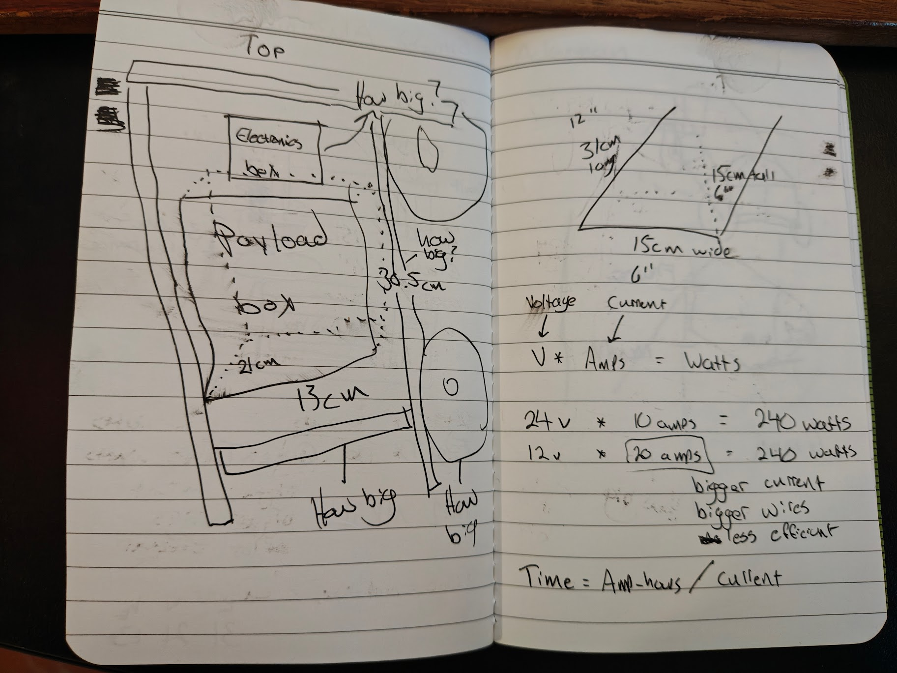
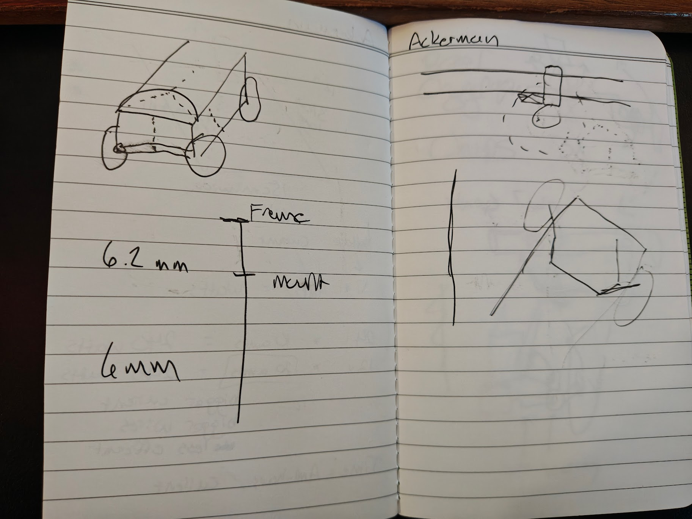
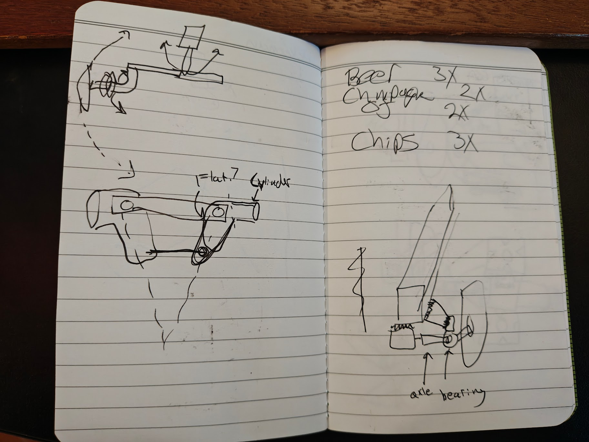
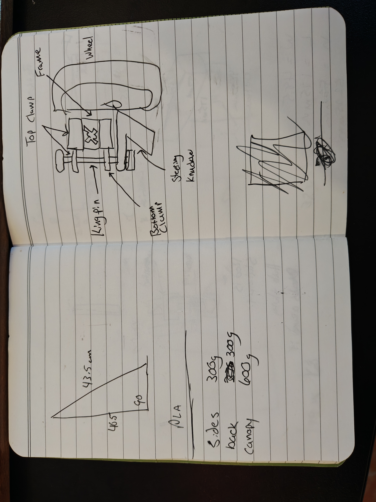

# Design Notes and Calculations

Hand-drawn notes and calculations from the rover design process.

## Early Concept Sketches

## Battery and Power Calculations

## Steering Geometry

## Wheel and Steering Assembly

