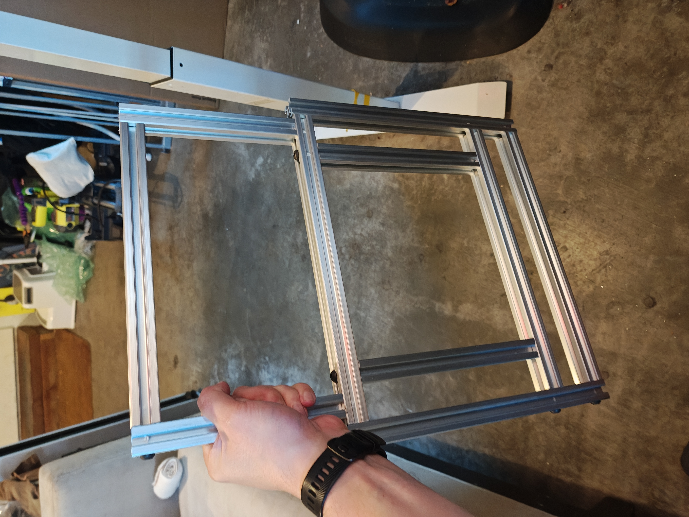

- # Autonomous Ground Vehicle
  
  An ongoing project building an autonomous ground vehicle capable of GPS waypoint navigation across varied suburban terrain.
  
  
- ## Skills I picked up
- **Mechanical Design:** CAD modeling, Ackerman steering geometry, drivetrain layout, 3D printed component design
- **Fabrication:** Aluminum frame construction, 3D printing (PLA/TPU), wiring harness assembly
- **Embedded Systems:** ArduPilot configuration, ESC/servo integration, RC systems
- **Software:** Onshape CAD, QGroundControl, ArduPilot firmware
- ## Project Requirements
  
  | Requirement | Specification |
  |-------------|---------------|
  | Payload capacity | 10 lbs |
  | Target speed | ~3 mph |
  | Terrain | Paved surfaces, sidewalks, curbs, grass, mild grades |
  | Navigation | GPS waypoint autonomy via ArduPilot |
  | Operating range | Multi-kilometer |
- ## Technical Specifications
  
  | System | Component | Details |
  |--------|-----------|---------|
  | Frame | 2020 aluminum extrusion | 24" x 18" custom welded/bolted frame |
  | Drivetrain | Brushed DC motors | Dual HOBBYWING QUICRUN 1080 G2 ESCs, 540 40T motors |
  | Steering | Ackerman geometry | Zoskay DS3235 servo (35kg-cm torque) |
  | Flight controller | SpeedyBee F405 WING | STM32F405 @ 168MHz, ArduPilot Rover firmware |
  | GPS | Matek M10Q-5883 | GPS + magnetometer module |
  | Power | Dual 3S LiPo | 15000mAh each, 333Wh total capacity |
  | Wheels | Custom 3D-printed | 17cm diameter, 6.5cm width, 6000RS bearings |
  | RC | ExpressLRS | Radiomaster TX12 MKII transmitter, BetaFPV SuperD receiver |
  
  <!-- TODO: Add measured specs once available:
  - Total vehicle weight
  - Ground clearance
  - Turning radius
  - Estimated runtime at cruise speed
  - Max grade capability
  -->
- ## Design Decisions
- ### Ackerman Steering Geometry
  
  <!-- TODO: Add rationale - why Ackerman over skid steer or differential?
  Likely: better tire wear, more natural turning, works well with ArduPilot rover mode -->
  
  Selected Ackerman steering to provide proper turning geometry where the inside wheel turns at a sharper angle than the outside wheel, reducing tire scrub and improving low-speed maneuverability.
- ### Brushed vs Brushless Motors
  
  Selected brushed DC motors for this application. At the target speed of 3 mph, brushed motors provide adequate performance with simpler control characteristics and better low-speed torque control compared to sensored brushless alternatives.
  
  <!-- TODO: Add more detail on motor selection criteria, torque calculations -->
- ### Wheel Design
  
  Custom 17cm diameter wheels were designed to provide sufficient ground clearance for curb transitions while maintaining a low center of gravity.
  
  <!-- TODO: Add:
  - Ground clearance measurement
  - Why 17cm specifically (curb height + clearance margin?)
  - TPU tire durometer/flexibility choice
  - Bearing selection rationale
  -->
- ## Build Progress
- ### Frame and Body
  
  
  
  <!-- TODO: Fill in details about:
  - Frame material selection (why 2020 extrusion)
  - Dimensions and layout decisions
  - Fabrication process (cutting, drilling, tapping)
  - Body panel design (if applicable)
  -->
- ### Powertrain
  
  <!-- TODO: Fill in details about:
  - Motor selection and mounting
  - ESC integration
  - Bearings and axle design
  - Gear reduction (if any)
  - Flexible couplers
  -->
- ### Steering
  
  <!-- TODO: Fill in details about:
  - Ackerman geometry implementation
  - Steering linkage design
  - Servo mounting iterations
  - Knuckle and tie rod design
  -->
- ### Wheels and Tires
  
  
  
  <!-- TODO: Fill in details about:
  - Wheel design (diameter, width, hub interface)
  - Tire material and tread pattern
  - Bearing selection and press-fit
  -->
- ### Electronics
  
  <!-- TODO: Fill in details about:
  - Flight controller setup
  - ESC/servo wiring
  - Power distribution
  - RC receiver integration
  - ArduPilot configuration
  -->
- ## Current Status
  
  
  
  <video controls width="100%">
  <source src="images/VID_20251209_151820062.mp4" type="video/mp4">
  </video>
  
  Current focus is on electronics integration and validating RC control before implementing autonomous navigation. Components are subject to iteration as testing reveals needed improvements.
- ## Tools & Software
- **CAD:** Onshape
- **Slicing:** PrusaSlicer
- **Mission Planning:** QGroundControl
- **Firmware:** ArduPilot Rover